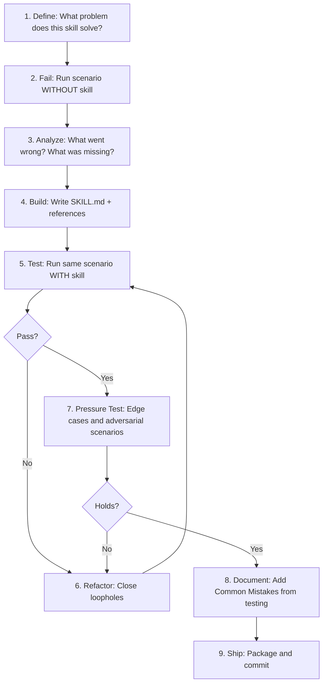

# AgentPad Skill Design Pattern

**Date:** 2026-02-12
**Status:** Approved (Historical - see note below)
**Author:** Brainstorm session between owner and AI

---

> **Note:** This is the original design document used for planning. The **canonical working process** is now in [`directives/build_skill.md`](../../directives/build_skill.md), which uses review gates and max-1-revision constraints for credit efficiency. All committed skills (Batch 0 + Batch 1) were built using the directive. This document remains for historical context and high-level understanding of the skill architecture.

---

## Goal

Establish a repeatable, test-driven process for building 61+ agent skills that are methodology-heavy, well-structured, and genuinely useful for developers and AI-assisted product development. Skills follow the Cursor SKILL.md format and will be open-sourced as the GTM funnel.

## Skill Anatomy (the standard)

Every AgentPad skill follows this structure, adapted from the existing `skills/SKILL-creator.md` format but extended for methodology-heavy research/analysis skills:

```
skill-name/
  SKILL.md              (required - frontmatter + core workflow, <500 lines)
  references/
    framework.md        (detailed methodology, scoring rubrics, decision trees)
    output-schema.md    (exact structure of what the skill produces)
    worked-example.md   (real-world scenario with full expected output)
  scripts/              (optional - only if the skill has deterministic steps)
  assets/               (optional - templates, scoring spreadsheets, etc.)
```

### SKILL.md Structure (every skill)

1. **Frontmatter:** `name`, `description` (includes "Use when..." triggers)
2. **Overview:** 2-3 sentences on what this skill does and why it matters
3. **Core Workflow:** Numbered steps the AI follows (the methodology)
4. **Output Format:** What the final output looks like (structure, not content)
5. **Quality Criteria:** How to tell if the output is good (checklist)
6. **Reference Links:** Pointers to `references/` files for deep detail
7. **Common Mistakes:** What to avoid (based on testing -- added during iteration)

### references/ Structure (methodology-heavy skills)

- **framework.md:** The full methodology with scoring rubrics, decision trees, evaluation criteria. Example: for Competitor Research, this includes how to evaluate competitors across 8 dimensions with scoring scales.
- **output-schema.md:** JSON-like schema or structured template defining exactly what fields/sections the output must contain. This is the structural validation contract from Section 16 of the product design doc.
- **worked-example.md:** One complete, realistic worked example showing the skill applied to a real SaaS scenario. Input, reasoning, and full output. This serves as both documentation and a "golden set" test case.

---

## Skill Creation Process (per skill)

Combines Anthropic's skill-creator with Superpowers' TDD approach:


```mermaid
flowchart TD
    A["1. Define: What problem does this skill solve?"] --> B["2. Fail: Run scenario WITHOUT skill"]
    B --> C["3. Analyze: What went wrong? What was missing?"]
    C --> D["4. Build: Write SKILL.md + references"]
    D --> E["5. Test: Run same scenario WITH skill"]
    E --> F{Pass?}
    F -->|No| G["6. Refactor: Close loopholes"]
    G --> E
    F -->|Yes| H["7. Pressure Test: Edge cases and adversarial scenarios"]
    H --> I{Holds?}
    I -->|No| G
    I -->|Yes| J["8. Document: Add Common Mistakes from testing"]
    J --> K["9. Ship: Package and commit"]
```

### Step 1: Define (15 min)

For each skill, answer:

- What specific problem does this skill solve that a raw LLM cannot?
- What does a user say/ask that should trigger this skill?
- What does "good" output look like? (draft the output schema)
- What framework or methodology should the skill encode?

### Step 2: Fail First (30 min)

Run a realistic scenario in Cursor **without** the skill. Example for Competitor Research: ask the AI to "analyze competitors for a SaaS invoicing tool for freelancers." Record:

- What the AI produces without guidance
- Where it's generic, shallow, or wrong
- What frameworks or structure it misses
- What a human product manager would do differently

This baseline is the "red" test.

### Step 3: Analyze Gaps (15 min)

From the failure, identify:

- Missing methodology (it didn't use any scoring framework)
- Missing structure (output was a wall of text, not a structured comparison)
- Missing depth (it listed competitors but didn't analyze pricing models or switching costs)
- Missing skepticism (it didn't challenge whether the competitors are actually competitors)

### Step 4: Build the Skill (1-2 hours)

Write SKILL.md and references/ files that address every gap identified:

- Core workflow encodes the methodology step by step
- Output schema defines the exact structure
- Framework reference provides the scoring rubrics and decision trees
- Worked example shows the full expected output

### Step 5: Test (30 min)

Run the **same scenario** with the skill loaded. Compare output to the baseline. The skill passes if:

- Output follows the defined schema
- Methodology is visibly applied (not just mentioned)
- Output is specific to the scenario (not generic)
- Quality criteria checklist passes

### Step 6-7: Refactor and Pressure Test (30 min)

Run adversarial scenarios:

- Vague input ("analyze my competitors" with no context)
- Edge cases (no obvious competitors, niche market)
- Conflicting data (competitor info that contradicts)
- Time pressure ("just give me a quick summary")

Close loopholes by adding explicit guidance for each failure mode.

### Step 8: Document Common Mistakes (15 min)

Add a "Common Mistakes" section to SKILL.md based on everything observed during testing. This is the self-annealing principle from the 3-layer architecture.

### Step 9: Ship (10 min)

Commit with a standardized commit message: `Add [skill-name] skill: [one-line description]`

**Total time per skill: ~3-4 hours for methodology-heavy skills, ~1-2 hours for lighter skills.**

---

## Skill Quality Standards

Every skill must meet these criteria before shipping:

- **Tested against baseline:** Demonstrably better output than raw LLM
- **Output schema defined:** Structural validation possible
- **Worked example included:** At least one realistic, complete example
- **Trigger description clear:** Another developer can read the frontmatter and know when to use it
- **Under 500 lines:** SKILL.md stays lean; detail lives in references/
- **Common Mistakes populated:** At least 3 failure modes documented from testing
- **SaaS-specific:** Examples and frameworks reference SaaS/digital product scenarios, not generic business

---

## Build Priority and Batching

Skills are built in batches aligned with the product roadmap. Each batch is completed and tested before starting the next.

### Batch 0: Skill Infrastructure (build first)

- Create the skill template directory and standard files
- Create a `directives/build_skill.md` directive encoding this process
- Create a skill quality checklist as a reference file

### Batch 1: MVP Skills (5 skills -- needed for product MVP)

1. Product Manager: Competitor Research
2. Product Manager: Feature Prioritization
3. Business Analyst: Business Case Modeling
4. Business Analyst: Requirements Elicitation
5. Devil's Advocate: Assumption Challenging + Value Proposition Testing + Customer Objection Modeling (combined as one skill)

### Batch 2: MVP Support Skills (4 skills -- enriches MVP output)

6. UI/UX Designer: User Persona Creation
7. UI/UX Designer: User Journey Mapping
8. User Researcher: Feedback Synthesis
9. Data Analyst: SaaS Metrics Analysis

### MVP Deliverable: Validation Pack

With Batches 1-2 complete, 7 of the 9 skills chain into the **Validation Pack** — a single shareable artifact that answers "Is this idea worth building, and what should I build first?" The pack runs skills in sequence (Requirements Elicitation → User Persona Creation → Competitor Research → Business Case Modeling → Devil's Advocate → Feature Prioritization → User Journey Mapping), with 3 decision gates that can halt the flow with a GO / PAUSE / KILL recommendation.

- **Design:** [`docs/plans/validation-pack-design.md`](validation-pack-design.md)
- **Orchestration directive:** [`directives/run_validation_pack.md`](../../directives/run_validation_pack.md)
- **Output schema:** [`skills/validation-pack/output-schema.md`](../../skills/validation-pack/output-schema.md)

Feedback Synthesis and SaaS Metrics Analysis are excluded from the MVP pack (they require existing user data) but become relevant in the Pro tier.

### Batch 3: Strategic Skills (7 skills -- Phase 2/3)

> **Restructured** based on devil's advocate assessment (see plan file). Original 9 skills had critical gaps: no bridge from validation to architecture, underweight Systems Architect, 60% overlap between Security/Compliance data skills, no orchestration, GDPR-centric bias, premature SOC 2 and Incident Response, and commodity Privacy Policy. Restructured to 7 skills + 1 orchestration directive.

**Systems Architect (1 skill):**
10. Architecture Design — Data flows, component boundaries, auth approach, storage decisions. Tightly scoped to Container-level C4; defers API specs, infra, scalability to Batch 6.

**Security Officer (4 skills):**
11. Security Requirements Baseline (NEW, replaces Incident Response Planning) — Minimum security posture for launch, based on OWASP ASVS Level 1.
12. Threat Modeling — STRIDE analysis on Architecture Design output.
13. Security Architecture Review — Evaluate architecture for weaknesses (auth, data handling, API security, dependencies).
14. Data Protection Assessment (EXPANDED, absorbs Data Processing Mapping) — Full data lifecycle: inventory, flows, PII exposure, access controls, retention, and protection recommendations.

**Compliance Expert (2 skills, was 4):**
15. Privacy Regulation Assessment (REPLACES GDPR Audit) — Triage which regulations apply (GDPR, CCPA, HIPAA, PCI-DSS, etc.), deep-dive on relevant ones. Privacy policy generated as output artifact.
16. Security & Compliance Roadmap (REPLACES SOC 2) — Which certs/frameworks to pursue and when, mapped to business milestones.

**Removed:**
- Data Processing Mapping → merged into Data Protection Assessment (60% overlap)
- GDPR Compliance Audit → replaced by Privacy Regulation Assessment (multi-regulation)
- SOC 2 Readiness Assessment → replaced by Security & Compliance Roadmap (premature for audience)
- Incident Response Planning → deferred to post-launch batch (no deployed system)
- Privacy Policy Generation → demoted to output artifact (commodity)

### Batch 3 Deliverable: Technical Readiness Pack

With Batch 3 complete, all 7 skills chain into the **Technical Readiness Pack** — a single shareable artifact that answers "Is this architecture secure, compliant, and ready to build?" The pack runs skills in sequence (Architecture Design → Security Requirements Baseline → Threat Modeling → Security Architecture Review → Data Protection Assessment → Privacy Regulation Assessment → Security & Compliance Roadmap), with 2 decision gates that can halt the flow with a READY / NEEDS WORK / REDESIGN recommendation.

- **Design:** [`docs/plans/technical-readiness-pack-design.md`](technical-readiness-pack-design.md)
- **Orchestration directive:** [`directives/run_technical_readiness_pack.md`](../../directives/run_technical_readiness_pack.md)
- **Output schema:** [`skills/technical-readiness-pack/output-schema.md`](../../skills/technical-readiness-pack/output-schema.md)

### Batch 4: Remaining Research Skills (11 skills)

19-23. Remaining Product Manager, Business Analyst, UI/UX skills
24-28. Remaining User Researcher, Data Analyst skills

### Batch 5: Go-to-Market Skills (14 skills)

29-32. Marketing Expert (4 skills)
33-36. Product Marketing Expert (4 skills)
37-40. SEO Expert (4 skills)
41-42. Remaining Devil's Advocate skills

### Batch 6: Technical Skills (13 skills)

43-47. Systems Architect remaining + Database Expert (9 skills)
48-51. Frontend Expert (4 skills)

---

## Deliverables

1. **Skill template** -- `skills/_template/` directory with skeleton SKILL.md, references/, and README for contributors
2. **Build directive** -- `directives/build_skill.md` encoding the full creation process
3. **Quality checklist** -- Reference file used during skill review
4. **First skill built** -- Competitor Research, as the proof-of-concept that validates the pattern
5. **Validation Pack** -- `directives/run_validation_pack.md` + `skills/validation-pack/output-schema.md` — the orchestrated skill chain that produces the MVP deliverable
6. **Technical Readiness Pack** -- `directives/run_technical_readiness_pack.md` + `skills/technical-readiness-pack/output-schema.md` — the orchestrated skill chain that produces the Batch 3 deliverable
