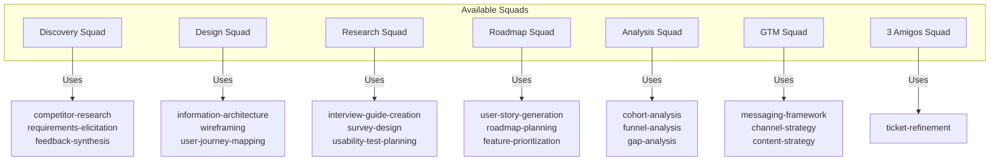
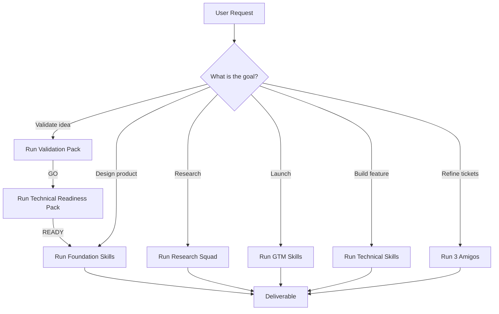
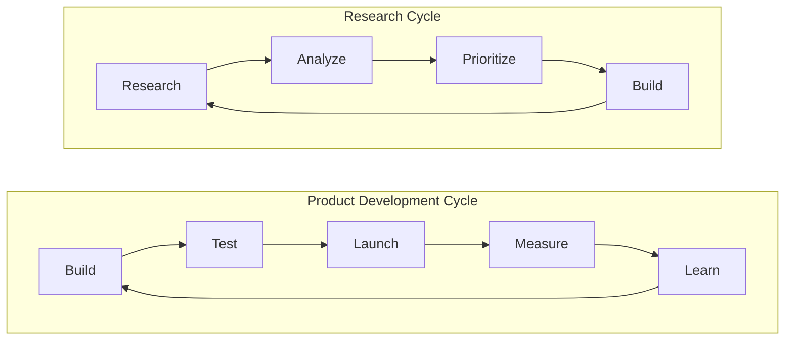

# Master Skill Flow

**Date:** 2026-02-21
**Status:** Complete - AI Agent Ready

---

## Overview

This document shows the complete skill architecture for AgentPad, organized into 7 batches. It defines dependencies, team configurations, and data flows. AI agents should follow this flow to determine which skills to use based on user goals.

---

## High-Level Flow (Mermaid)

```mermaid
flowchart TB
    subgraph BATCH0["Batch 0: Security Foundation"]
        direction TB
        S0A[security-baseline-pack]
        S0B[security-requirements-baseline]
        S0C[threat-modeling]
        S0D[security-architecture-review]
        S0E[data-protection-assessment]
        S0F[privacy-regulation-assessment]
        S0G[security-compliance-roadmap]
    end

    subgraph BATCH1["Batch 1: Validation Packs"]
        direction TB
        V1[validation-pack]
        V2[technical-readiness-pack]
    end

    subgraph BATCH2["Batch 2: Architecture & Foundation"]
        direction TB
        A1[architecture-design]
        A2[requirements-elicitation]
        A3[feature-prioritization]
        A4[user-persona-creation]
        A5[user-journey-mapping]
        A6[feedback-synthesis]
        A7[saas-metrics-analysis]
        A8[devils-advocate]
        A9[business-case-modeling]
    end

    subgraph BATCH3["Batch 3: Completion"]
        direction TB
        C1[competitor-research]
        C2[business-case-modeling]
    end

    subgraph BATCH4["Batch 4: Research Squad"]
        direction TB
        R1[user-story-generation]
        R2[pricing-strategy]
        R3[roadmap-planning]
        R4[gap-analysis]
        R5[process-mapping]
        R6[stakeholder-analysis]
        R7[information-architecture]
        R8[wireframing]
        R9[heuristic-evaluation]
        R10[interview-guide-creation]
        R11[survey-design]
        R12[usability-test-planning]
        R13[cohort-analysis]
        R14[funnel-analysis]
        R15[ab-test-design]
        R16[data-visualization]
    end

    subgraph BATCH5["Batch 5: Go-to-Market"]
        direction TB
        G1[launch-planning]
        G2[messaging-framework]
        G3[content-strategy]
        G4[channel-strategy]
        G5[launch-analytics]
        G6[seo-foundation]
        G7[paid-acquisition]
        G8[sales-enablement]
        G9[community-building]
        G10[partner-strategy]
        G11[pricing-launch]
        G12[referral-program]
        G13[analyst-relations]
        G14[devils-advocate-gtm]
    end

    subgraph BATCH6["Batch 6: Technical"]
        direction TB
        T1[data-modeling]
        T2[schema-design]
        T3[migration-planning]
        T4[performance-tuning]
        T5[data-security]
        T6[backup-recovery]
        T7[component-architecture]
        T8[ui-patterns]
        T9[design-system]
        T10[animation-motion]
        T11[state-management]
        T12[accessibility-review]
        T13[responsive-patterns]
        T14[frontend-performance]
        T15[test-strategy]
        T16[automation-framework]
        T17[tdd]
        T18[infrastructure-as-code]
        T19[ci-cd-pipeline]
        T20[monitoring-observability]
        T21[cloud-platforms]
        T22[api-design]
        T23[mobile-ios]
        T24[mobile-android]
        T25[serverless-development]
        T26[ml-llm-integration]
        T27[edge-computing]
        T28[ticket-refinement]
    end

    BATCH0 --> BATCH1
    BATCH1 --> BATCH2
    BATCH2 --> BATCH3
    BATCH3 --> BATCH4
    BATCH4 --> BATCH5
    BATCH5 --> BATCH6
```

---

## Detailed Flow with Data Contracts

---

## Squad Configurations (Team Setups)

---

## Decision Flow for AI Agents

---

## Skill-to-Squad Mapping

| Squad | Primary Skills | Secondary Skills |
|-------|---------------|------------------|
| Discovery Squad | competitor-research, requirements-elicitation, feedback-synthesis | user-persona-creation, user-journey-mapping |
| Design Squad | information-architecture, wireframing, user-journey-mapping | heuristic-evaluation, usability-test-planning |
| Research Squad | interview-guide-creation, survey-design, usability-test-planning | feedback-synthesis, cohort-analysis |
| Roadmap Squad | user-story-generation, roadmap-planning, feature-prioritization | stakeholder-analysis, gap-analysis |
| Analysis Squad | cohort-analysis, funnel-analysis, gap-analysis | ab-test-design, data-visualization |
| GTM Squad | launch-planning, messaging-framework, channel-strategy, content-strategy, launch-analytics, seo-foundation | All Batch 5 skills |
| 3 Amigos Squad | ticket-refinement | All Batch 6 skills as needed |

---

## Data Contracts: Key Handoffs

### Batch 0 → Batch 1

| Output | Input To |
|--------|----------|
| threat-model findings | technical-readiness-pack |
| security requirements | validation-pack (optional) |

### Batch 1 → Batch 2

| Output | Input To |
|--------|----------|
| GO/PAUSE/KILL verdict | All Batch 2 skills |
| validated requirements | requirements-elicitation |
| MVP scope | feature-prioritization |

### Batch 2 → Batch 3

| Output | Input To |
|--------|----------|
| requirements | competitor-research |
| personas | competitor-research |
| business case | competitor-research |

### Batch 2 → Batch 4

| Output | Input To |
|--------|----------|
| requirements | user-story-generation |
| personas | interview-guide-creation |
| journey | wireframing, heuristic-evaluation |
| metrics | cohort-analysis, ab-test-design |

### Batch 3 → Batch 4

| Output | Input To |
|--------|----------|
| competitive analysis | pricing-strategy |
| market sizing | cohort-analysis |

### Batch 4 → Batch 5

| Output | Input To |
|--------|----------|
| user insights | messaging-framework |
| pricing data | pricing-launch |
| roadmap | launch-planning |

### Batch 5 → Batch 6

| Output | Input To |
|--------|----------|
| launch requirements | All Batch 6 skills |
| channel specs | api-design |

---

## Iteration Loops

---

## Quick Reference: Which Batch?

| User Goal | Use These Batches |
|-----------|------------------|
| "Is this idea worth building?" | Batch 1 (Validation Pack) |
| "Is the product ready technically?" | Batch 1 (Technical Readiness) |
| "What should we build?" | Batch 2 → Batch 4 |
| "How do users behave?" | Batch 2 → Batch 4 (Research) |
| "How do we launch?" | Batch 5 (GTM) |
| "How do we build it?" | Batch 6 (Technical) |
| "How do we improve?" | Batch 4 → Batch 6 (iteration) |
| "What security is needed?" | Batch 0 (always) |

---

## Total Skills by Batch

| Batch | Name | Skills |
|-------|------|--------|
| 0 | Security Foundation | 7 |
| 1 | Validation Packs | 2 |
| 2 | Architecture & Foundation | 9 |
| 3 | Completion | 2 |
| 4 | Research Squad | 16 |
| 5 | Go-to-Market | 14 |
| 6 | Technical | 28 |
| **Total** | | **78** |

---

## Document Status

**Status:** Complete
**Last Updated:** 2026-02-21

This document is designed for AI agents to:
1. Understand the overall skill architecture
2. Determine which skills to use based on user goals
3. Follow data contracts between skills
4. Assemble squads for specific tasks
