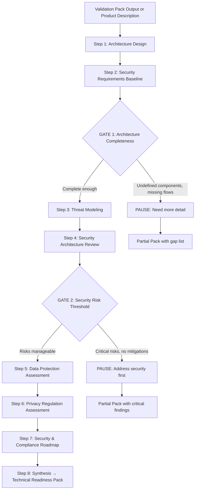

# Technical Readiness Pack Design

**Date:** 2026-02-19
**Status:** Active
**Author:** Brainstorm session between owner and AI
**Scope:** Defines the Technical Readiness Pack — the tangible deliverable produced by chaining Batch 3 skills into a cohesive artifact

---

## 1. What Is the Technical Readiness Pack

The Technical Readiness Pack is a single, shareable document that answers: **"Is this architecture secure, compliant, and ready to build?"**

It chains all 7 Batch 3 skills in a defined sequence, with each skill's output feeding the next as context. Two decision gates can halt the flow early with a NEEDS WORK or REDESIGN recommendation. The output includes a consolidated risk register, certification roadmap, and clear READY / NEEDS WORK / REDESIGN verdict.

**Why it matters:** Individual security and compliance skills are useful in isolation, but their real value emerges when composed. A threat model built on a concrete architecture, reviewed against security best practices, with data protection mapped and regulations triaged — that compound analysis is what no individual ChatGPT session can replicate.

Three things the Technical Readiness Pack provides that vanilla LLM usage cannot:

1. **Context accumulation** — each skill references the specific outputs of previous skills. Threat Modeling runs STRIDE against the exact architecture, not a generic one. Privacy Regulation Assessment triages based on the actual data inventory, not assumptions.
2. **Decision gates** — the flow encodes security judgment. It tells users "your architecture has critical flaws — address these before continuing to compliance" rather than producing a compliance assessment on an insecure foundation.
3. **The artifact** — users don't want 7 separate analyses. They want a document they can show a CTO, include in due diligence, or reference while building.

---

## 2. Where This Fits in the Product Architecture

The Technical Readiness Pack follows the Validation Pack in the user journey:

```
Validation Pack (Batches 1-2)          Technical Readiness Pack (Batch 3)
"Should I build this?"          →      "Is the design ready to build?"
  Requirements                           Architecture Design
  Personas                               Security Requirements
  Competitors                            Threat Modeling
  Business Case                          Security Architecture Review
  Devil's Advocate                       Data Protection
  Feature Priority                       Privacy Regulation
  Journey Mapping                        Compliance Roadmap
  → GO / PAUSE / KILL                    → READY / NEEDS WORK / REDESIGN
```

**Input:** Validation Pack output (preferred) or standalone product description
**Output:** Technical Readiness Pack document + verdict

---

## 3. Skill Chaining Specification

### Flow Diagram



### Skills Used (7 of 7)

| Step | Skill | Role | Purpose in Chain |
|------|-------|------|-----------------|
| 1 | Architecture Design | Systems Architect | Produce the system architecture all other skills consume |
| 2 | Security Requirements Baseline | Security Officer | Define minimum security bar for launch |
| 3 | Threat Modeling | Security Officer | STRIDE analysis on the architecture |
| 4 | Security Architecture Review | Security Officer | Evaluate architecture against threats |
| 5 | Data Protection Assessment | Security Officer | Full data lifecycle inventory and protection |
| 6 | Privacy Regulation Assessment | Compliance Expert | Triage regulations, assess compliance, draft privacy policy |
| 7 | Security & Compliance Roadmap | Compliance Expert | Timeline for certifications and frameworks |

---

## 4. Data Contracts Between Skills

Each skill consumes specific outputs from prior skills. This table defines the exact data handoffs:

### Step 1 → Step 2: Architecture Design → Security Requirements Baseline

| Field from Architecture Design | Maps to Security Baseline Input |
|-------------------------------|--------------------------------|
| containers (all, with tech choices) | Components to define requirements for |
| data_flows (with trust boundaries) | Trust boundaries to secure |
| auth_design | Auth requirements to validate |
| storage (data classification) | Data sensitivity → requirement priority |
| tech_stack | Implementation guidance targets |

### Step 2 → Step 3: Security Baseline → Threat Modeling

| Field from Security Baseline | Maps to Threat Modeling Input |
|-----------------------------|------------------------------|
| requirements_checklist (P0 items) | The security bar threats are measured against |
| architecture_risks | Known risk areas to focus STRIDE on |

### Step 1 → Step 3: Architecture Design → Threat Modeling

| Field from Architecture Design | Maps to Threat Modeling Input |
|-------------------------------|------------------------------|
| containers (all) | Components to apply STRIDE to |
| data_flows (with trust boundaries) | Flows to analyze for threats |
| auth_design | Auth mechanisms to evaluate for spoofing/elevation |

### Steps 1,3 → Step 4: Architecture + Threat Model → Security Architecture Review

| Field | Maps to Security Review Input |
|-------|------------------------------|
| architecture.containers | Components to review |
| architecture.auth_design | Auth flows to trace end-to-end |
| architecture.data_flows | API endpoints and data handling to review |
| threat_model.stride_analysis | Prioritized threats to focus review on |
| threat_model.risk_register | Risk ratings to prioritize findings |

### Steps 1,2 → Step 5: Architecture + Security Baseline → Data Protection Assessment

| Field | Maps to Data Protection Input |
|-------|-------------------------------|
| architecture.data_flows | Data flows to inventory |
| architecture.storage | Data stores to catalog |
| architecture.containers | Systems that process data |
| security_baseline.requirements_checklist | Data protection requirements to assess against |

### Steps 1,5 → Step 6: Architecture + Data Protection → Privacy Regulation Assessment

| Field | Maps to Privacy Regulation Input |
|-------|----------------------------------|
| data_protection.data_inventory | What data exists (for regulation triage) |
| data_protection.pii_exposure_map | PII types (for regulation applicability) |
| data_protection.retention_policies | Retention practices (for compliance assessment) |
| architecture.containers | Infrastructure location (for jurisdiction) |
| Validation Pack context | Target market geography, customer segments |

### All prior → Step 7: All → Security & Compliance Roadmap

All prior context fields consumed to produce the synthesis roadmap.

---

## 5. Decision Gates

### Gate 1: Architecture Completeness (after Step 2)

**Purpose:** Prevent running security analysis against an incomplete architecture. If the architecture has major undefined components or missing data flows, threat modeling produces meaningless results.

**Trigger conditions:**
- Architecture output has > 2 TBD/undefined components
- Security baseline has > 5 requirements that couldn't be mapped to specific components
- No data flow diagrams produced

**User options if triggered:**
1. Provide more detail → revise architecture → continue
2. Stop → receive partial pack with gap list

### Gate 2: Security Risk Threshold (after Step 4)

**Purpose:** Prevent continuing to compliance assessment when the architecture has critical security flaws. Compliance analysis on an insecure architecture wastes effort — the architecture needs to change first.

**Trigger conditions:**
- 2+ Critical threats with no viable mitigation
- Security Architecture Review finds fundamental auth/data handling flaws requiring redesign
- Security review overall assessment = "Critical"

**User options if triggered:**
1. Revise architecture to address critical findings → re-run from Step 1 (one revision only)
2. Continue anyway → pack produced with prominent warnings
3. Stop → receive partial pack with critical findings and recommended changes

---

## 6. Relationship to Validation Pack

The Technical Readiness Pack is designed to consume Validation Pack output but can also run standalone:

| Mode | Input | What Changes |
|------|-------|-------------|
| **Post-Validation** | Full Validation Pack context | Architecture Design uses validated requirements, personas, feature backlog. Richer output, better-scoped architecture |
| **Standalone** | User-provided product description | Architecture Design starts from scratch. User answers more questions in Step 0. Output is valid but less grounded in user research |

The two packs together form a complete validation-to-build pipeline:
1. Validation Pack: "Should I build this?" → GO
2. Technical Readiness Pack: "Is the design ready?" → READY
3. Build with confidence

---

## 7. Output Document Structure

The Technical Readiness Pack output schema is defined in `skills/technical-readiness-pack/output-schema.md`. Summary:

| Section | Content | Source Skills |
|---------|---------|-------------|
| 1. Architecture Summary | System diagrams, tech choices, key decisions | Architecture Design |
| 2. Security Posture | Requirements status, top threats, review findings | Security Baseline + Threat Modeling + Security Review |
| 3. Data Protection | Data inventory, PII map, protection posture | Data Protection Assessment |
| 4. Regulatory Compliance | Applicable regulations, compliance status, privacy policy | Privacy Regulation Assessment |
| 5. Certification Roadmap | Phased timeline, quick wins, investment summary | Security & Compliance Roadmap |
| 6. Risk Register | Top 10 consolidated risks from all skills | All skills |
| 7. Recommendation | READY / NEEDS WORK / REDESIGN with rationale and next steps | Synthesis |

Expected length: 4,000-7,000 words depending on architecture complexity and number of applicable regulations.
