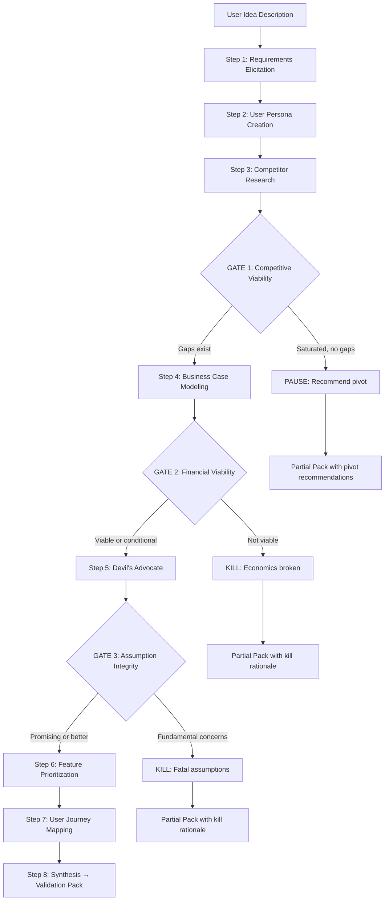

# Validation Pack Design

**Date:** 2026-02-16
**Status:** Active
**Author:** Brainstorm session between owner and AI
**Scope:** Defines the Validation Pack — the tangible deliverable produced by chaining Batch 1 + Batch 2 skills into a cohesive artifact

---

## 1. What Is the Validation Pack

The Validation Pack is a single, shareable document that answers: **"Is this idea worth building, and if so, what specifically should I build first?"**

It chains 7 of the 9 built skills in a defined sequence, with each skill's output feeding the next as context. Three decision gates can halt the flow early with a KILL or PAUSE recommendation. Three industry-recognised matrices (Lean Startup Importance vs. Proof, Risk-Value, Impact-Effort) give the output institutional credibility.

**Why it matters:** Individual skills are the raw material — a skilled user could replicate any single one with a well-crafted prompt. The Validation Pack provides three things vanilla LLM usage cannot:

1. **Context accumulation** — each skill references the specific outputs of previous skills. The Devil's Advocate challenges the exact assumptions from the business case, not generic ones.
2. **Decision gates** — the flow encodes PM judgment. It tells users "stop here — your business case doesn't hold up" rather than generating more artifacts.
3. **The artifact** — users don't want 5 chat transcripts. They want a document they can show a co-founder, use to pitch, or reference while building.

---

## 2. Where This Fits in the Existing Architecture

The product design doc (`docs/plans/2026-02-12-agentpad-product-design.md`) defines a Discovery Mode pipeline: Idea Input → Refinement → Validation → Prioritization → Execution → Review. The Validation Pack is the **concrete deliverable of Stages 1-4** using existing skills. It makes the abstract pipeline tangible.

### Monetization Alignment

| Layer | What they get | Price |
|-------|--------------|-------|
| Open | Raw skill `.md` files on GitHub | Free |
| Free tier | One idea through Validation flow → basic report | Free |
| Pro | Unlimited ideas, full incubation phases, premium deliverables | $29-49/mo |
| Cohort | Guided 30-day incubation with async feedback | $199-499 one-time |

Skills are open (builds awareness, SEO, credibility). The orchestrated flow + polished output is the product.

---

## 3. Skill Chaining Specification

### Flow Diagram

### Skills Used (7 of 9)

| Step | Skill | Batch | Purpose in Chain |
|------|-------|-------|-----------------|
| 1 | Requirements Elicitation | 1 | Extract structured context from raw idea |
| 2 | User Persona Creation | 2 | Build behavior-driven personas |
| 3 | Competitor Research | 1 | Map landscape and identify gaps |
| 4 | Business Case Modeling | 1 | Model revenue and unit economics |
| 5 | Devil's Advocate | 1 | Stress-test accumulated assumptions |
| 6 | Feature Prioritization | 1 | Score and rank features for MVP |
| 7 | User Journey Mapping | 2 | Validate MVP scope via journey analysis |

### Skills Excluded from MVP Pack

| Skill | Batch | Reason | When It Becomes Relevant |
|-------|-------|--------|-------------------------|
| Feedback Synthesis | 2 | Requires existing user feedback data | Pro tier, when data connections exist |
| SaaS Metrics Analysis | 2 | Requires existing revenue/usage data | Pro tier, when Stripe/analytics connected |

---

## 4. Data Contracts (Skill-to-Skill)

Each skill receives accumulated context from prior skills. This section defines the exact fields that flow between skills.

### Step 1 → Step 2: Requirements Elicitation → User Persona Creation

| Field from Requirements Elicitation | Maps to User Persona Creation Input |
|-------------------------------------|--------------------------------------|
| Section 1 → Problem Statement: `target users` (primary and secondary roles) | Persona seed — roles to build personas around |
| Section 1 → Problem Statement: `problem` | Product context for JTBD formulation |
| Section 1 → Problem Statement: `current solution` | Feeds `Current Workflow` section |
| Section 1 → Scope: `constraints` | Informs technical proficiency and adoption expectations |
| Section 4 → Assumptions: all entries | Seed assumptions for persona-level confidence tagging |

### Step 2 → Step 3: User Persona Creation → Competitor Research

| Field from User Persona Creation | Maps to Competitor Research Input |
|----------------------------------|-----------------------------------|
| Persona → Identity: `role`, `context` | Defines who to research competitors for |
| Persona → JTBD: `functional job` | The job-to-be-done defines the competitive arena |
| Persona → Current Workflow: `tools used` | Direct competitors and adjacent solutions to profile |
| Persona → Pain Points: all entries | Gaps competitors may or may not address |
| Persona → Decision Criteria: `ranked criteria` | Dimensions for the comparison matrix weighting |
| Persona → SaaS Attributes: `switching costs` | Competitive switching analysis context |

### Step 3 → Step 4: Competitor Research → Business Case Modeling

| Field from Competitor Research | Maps to Business Case Modeling Input |
|-------------------------------|---------------------------------------|
| Section 1 → Competitive Arena: `scope` | Market segment definition for TAM/SAM/SOM |
| Section 2 → Competitor Profiles: `pricing` (all) | Pricing benchmark data for revenue model |
| Section 3 → Comparison Matrix: `weighted totals` | Competitive density signal for risk assessment |
| Section 4 → Gap Analysis: `underserved segments` | Market opportunity sizing input |
| Section 4 → Gap Analysis: `pricing gaps` | Pricing strategy input |
| Section 5 → Recommendations: `positioning statement` | Revenue model positioning context |
| Section 5 → Recommendations: `competitive risks` | Risk inputs for scenario analysis |

### Step 4 → Step 5: Business Case Modeling → Devil's Advocate

| Field from Business Case Modeling | Maps to Devil's Advocate Input |
|----------------------------------|--------------------------------|
| Section 8 → Assumptions Register: all entries | Primary input — every assumption to challenge |
| Section 7 → Viability Assessment: `verdict` | Sets the tone — conditionally viable ideas get harder scrutiny |
| Section 7 → Viability Assessment: `conditions for viability` | Specific conditions to stress-test |
| Section 4 → Unit Economics: `LTV:CAC ratio`, `payback period` | Financial assumptions to challenge |
| Section 6 → Scenario Analysis: `key risks` | Risk hypotheses to validate |
| Section 2 → Market Sizing: `TAM/SAM/SOM` with confidence | Market assumptions to challenge |

**Also forwarded from earlier steps:**
- User Persona Creation → Persona JTBD and pain points (for customer objection modeling)
- Competitor Research → Positioning and competitive risks (for blind spot identification)

### Step 5 → Step 6: Devil's Advocate → Feature Prioritization

| Field from Devil's Advocate | Maps to Feature Prioritization Input |
|----------------------------|---------------------------------------|
| Section 6 → Verdict: `recommended actions` | Influences feature scoring (features that address top risks score higher on Impact) |
| Section 2 → Assumption Challenges: `validation tests` | Features that enable assumption validation get priority |
| Section 3 → Value Proposition: test verdicts | Features aligned with passing value prop tests score higher |
| Section 4 → Customer Objections: all entries | Features that address top objections score higher on Reach |

**Also forwarded from earlier steps:**
- Requirements Elicitation → Section 2: Functional Requirements (the feature list to score)
- Requirements Elicitation → Section 5: Priority Matrix (MoSCoW as initial input)
- Competitor Research → Section 4: Gap Analysis: `feature gaps` (competitive gap features to include)
- User Persona Creation → Pain Points (persona pain severity informs Impact scoring)

### Step 6 → Step 7: Feature Prioritization → User Journey Mapping

| Field from Feature Prioritization | Maps to User Journey Mapping Input |
|----------------------------------|------------------------------------|
| Section 4 → Ranked Backlog: `Tier 1: Build Now` | The feature set to map the journey through |
| Section 5 → Analysis: `dependencies` | Sequence constraints for the journey |
| Section 5 → Analysis: `regret test` (top 3) | Validates that the journey delivers essential value |

**Also forwarded from earlier steps:**
- User Persona Creation → Primary persona (the persona whose journey is mapped)
- Requirements Elicitation → Section 1: Problem Statement (journey context)
- Competitor Research → Section 5: Recommendations: `positioning statement` (positioning context for awareness stage)

---

## 5. Decision Gates

Gates issue recommendations, not hard stops. The user can always override and continue. This respects "user remains the expert" (product design doc, Differentiator 5).

### GATE 1: Competitive Viability (after Competitor Research)

**Trigger condition for PAUSE:**
- Comparison Matrix shows 5+ direct competitors AND
- Gap Analysis `underserved segments` is empty or all identified gaps have Low confidence AND
- Gap Analysis `feature gaps` are all addressed by 2+ existing competitors

**PAUSE output:**
- Summary: "The competitive landscape for [product] is crowded with no clear gaps identified."
- Pivot suggestions: derived from any Indirect/Emerging competitor whitespace
- Recommendation: "Consider pivoting to [underserved adjacent segment] or differentiating on [unexploited dimension]."
- User can override: "Continue anyway — I believe I have a differentiation angle."

**Trigger condition for GO:**
- At least one underserved segment or feature gap with Medium+ confidence identified

### GATE 2: Financial Viability (after Business Case Modeling)

**Trigger condition for KILL:**
- Viability Assessment verdict = "Not viable under current assumptions" AND
- Pessimistic scenario shows no path to breakeven within the time horizon AND
- LTV:CAC ratio < 1.0 in both pessimistic and base scenarios

**KILL output:**
- Summary: "The unit economics for [product] do not support a viable business under current assumptions."
- Key numbers: LTV:CAC ratio, projected monthly burn, runway
- What would need to change: specific assumption values that would flip viability
- Recommendation: "Revisit the pricing model, cost structure, or target market before proceeding."

**Trigger condition for CONDITIONAL GO:**
- Viability Assessment verdict = "Conditionally viable"
- Pack continues but flags conditions prominently in the Validation Scorecard

**Trigger condition for GO:**
- Viability Assessment verdict = "Viable"
- LTV:CAC ratio >= 3.0 in base scenario

### GATE 3: Assumption Integrity (after Devil's Advocate)

**Trigger condition for KILL:**
- Devil's Advocate verdict = "Fundamental Concerns" AND
- 2+ assumptions with Impact if Wrong = "Fatal" have Certainty = "L" (Low) AND
- Value Proposition Assessment overall score = "Weak" (0-1 tests passed)

**KILL output:**
- Summary: "Critical assumptions underlying [product] are unvalidated and potentially fatal."
- Fatal assumptions listed with counter-arguments
- Validation roadmap: ordered list of what to test before re-attempting
- Recommendation: "Validate these assumptions before investing further."

**Trigger condition for GO:**
- Devil's Advocate verdict = "Strong" or "Promising"
- OR verdict = "Needs Work" but no Fatal-impact assumptions are unvalidated

---

## 6. The Three Matrices

### Matrix 1: Importance vs. Proof (Lean Startup Assumption Risk)

**Purpose:** Answers "What could kill this idea?" by plotting every critical assumption by how dangerous it is vs. how validated it is.

**Data sources:**
- Devil's Advocate → Section 1: Decomposed Assumptions (assumption name, category, certainty, impact if wrong)
- Business Case Modeling → Section 8: Assumptions Register (assumption, value, source, confidence, impact if wrong)

**Axis mapping:**

| Axis | Label | Data | Scale |
|------|-------|------|-------|
| X-axis | Proof Level | Confidence tag: L → Unvalidated, M → Partially Validated, H → Validated | 3-point (left to right) |
| Y-axis | Importance | Impact if Wrong: Minor → Major → Fatal | 3-point (bottom to top) |

**Quadrant interpretation:**

| Quadrant | Position | Label | Action |
|----------|----------|-------|--------|
| Top-left | High importance, low proof | **Validate First** | Test these before investing time/money |
| Top-right | High importance, high proof | **Known Strengths** | Foundation of the business case |
| Bottom-left | Low importance, low proof | **Monitor** | Not urgent, track over time |
| Bottom-right | Low importance, high proof | **Nice to Know** | Validated but non-critical |

**Population rules:**
1. Merge assumptions from both sources, deduplicating by content
2. When the same assumption appears in both skills with different confidence, use the lower confidence (conservative)
3. Minimum 8 assumptions plotted, maximum 15

### Matrix 2: Risk-Value (Opportunity Assessment)

**Purpose:** Answers "Is the upside worth the downside?" by plotting the overall idea on a single risk-vs-value point.

**Data sources and composite scoring:**

**Value score (1-10):**

| Component | Source | Weight | Scale |
|-----------|--------|--------|-------|
| Market size | Business Case → TAM/SAM/SOM | 30% | SOM < $1M = 1-3, $1-10M = 4-6, $10M+ = 7-10 |
| Differentiation gap | Competitor Research → Gap Analysis: number and strength of gaps | 30% | No gaps = 1-2, minor gaps = 3-5, clear whitespace = 6-8, blue ocean = 9-10 |
| Unit economics health | Business Case → LTV:CAC ratio | 40% | <1 = 1-2, 1-2 = 3-4, 2-3 = 5-6, 3-5 = 7-8, 5+ = 9-10 |

**Risk score (1-10):**

| Component | Source | Weight | Scale |
|-----------|--------|--------|-------|
| Competitive density | Competitor Research → Comparison Matrix: count of direct competitors | 30% | 1-2 = 1-3, 3-5 = 4-6, 6+ = 7-10 |
| Assumption risk | Devil's Advocate → count of unvalidated (L) Fatal/Major assumptions | 40% | 0-1 = 1-3, 2-3 = 4-6, 4+ = 7-10 |
| Technical complexity | Requirements Elicitation → Scope: constraints + dependency count | 30% | Low = 1-3, Medium = 4-6, High = 7-10 |

**Quadrant interpretation:**

| Quadrant | Position | Label | Recommendation |
|----------|----------|-------|---------------|
| Top-right | High value, low risk | **Go** | Strong opportunity — proceed to build |
| Top-left | Low value, low risk | **Consider** | Safe but small — viable lifestyle business |
| Bottom-right | High value, high risk | **Validate** | High potential but dangerous assumptions — test first |
| Bottom-left | Low value, high risk | **Walk Away** | Not worth the risk |

### Matrix 3: Impact-Effort (MVP Scoping)

**Purpose:** Answers "What should I build first?" by plotting each proposed feature.

**Data sources:**

| Axis | Source | Mapping |
|------|--------|---------|
| Y-axis: User Impact | Feature Prioritization → Scoring Table: Impact dimension score | Direct from RICE Impact (1-5) × primary persona pain severity average |
| X-axis: Build Effort | Feature Prioritization → Scoring Table: Effort dimension score | Direct from RICE Effort (1-5), cross-referenced with Requirements Elicitation dependency count |

**Quadrant interpretation:**

| Quadrant | Position | Label | Action |
|----------|----------|-------|--------|
| Top-left | High impact, low effort | **Quick Wins** | Build these first — they form the MVP core |
| Top-right | High impact, high effort | **Big Bets** | Schedule for post-MVP or phase 2 |
| Bottom-left | Low impact, low effort | **Fill-ins** | Build if time permits, nice-to-haves |
| Bottom-right | Low impact, high effort | **Deprioritise** | Not worth building now |

**Population rules:**
1. Plot every feature from Feature Prioritization Tier 1 (Build Now) and Tier 2 (Validate First)
2. Tier 3 (Park) features are shown in a muted style or listed separately
3. Features in the Quick Wins quadrant form the recommended MVP scope

---

## 7. Validation Pack Output Structure

The final deliverable contains 7 sections across approximately 8-12 pages.

### Section 1: Validation Scorecard (1 page)

The headline page. Contains a clear **GO / PAUSE / KILL** recommendation and 7 key metrics.

| Metric | Source | Good | Warning | Critical |
|--------|--------|------|---------|----------|
| Competitive density | Competitor Research → direct competitor count | 1-3 | 4-6 | 7+ |
| Differentiation gap | Competitor Research → Gap Analysis gap count with M+ confidence | 3+ gaps | 1-2 gaps | 0 gaps |
| TAM/SAM/SOM | Business Case → Market Sizing: SOM value | SOM > $10M | $1-10M | < $1M |
| Unit economics health | Business Case → LTV:CAC ratio (base scenario) | > 3:1 | 1-3:1 | < 1:1 |
| Assumption risk score | Devil's Advocate → count of Fatal/Major + Low confidence | 0-1 | 2-3 | 4+ |
| MVP complexity | Feature Prioritization → Tier 1 feature count + Requirements dependency count | S (1-3 features, 0-2 deps) | M (4-6 features, 3-5 deps) | L (7+ features, 6+ deps) |
| Time to value | User Journey Mapping → Stage 3 (Activation) Moment of Truth: trigger action timeline | Minutes | Hours-Days | Weeks+ |

**Recommendation logic:**
- **GO:** 0 Critical metrics, ≤ 1 Warning metric
- **PAUSE:** 1 Critical metric OR 3+ Warning metrics
- **KILL:** 2+ Critical metrics (or triggered by any decision gate)

### Section 2: Three Matrices (1-2 pages)

The three matrices defined in Section 6 above, each rendered as a labelled 2x2 with data points plotted. Each matrix includes:
- Title and one-sentence purpose
- Plotted data points with labels
- Quadrant labels
- 2-3 sentence interpretation specific to this idea

### Section 3: Competitive Positioning Map (1 page)

A 2x2 positioning map derived from Competitor Research.

- **Axes:** Chosen from the two most differentiating dimensions in the Comparison Matrix (the two dimensions where the user's product has the largest positive gap vs. competitors)
- **Plotted:** All profiled competitors + the user's product positioned in the identified whitespace
- **Annotation:** 2-3 sentences explaining the positioning opportunity

### Section 4: Assumption Register (1-2 pages)

Consolidated from Business Case Modeling (Section 8) + Devil's Advocate (Section 1 + Section 2).

| # | Assumption | Category | Importance | Proof Level | Validation Test | Priority |
|---|-----------|----------|-----------|-------------|-----------------|----------|
| 1 | [assumption text] | Problem / Customer / Solution / Market / Business Model / Timing | Fatal / Major / Minor | Validated / Partial / Unvalidated | [specific test from Devil's Advocate Section 2] | Validate First / Monitor / Known |

**Rules:**
- Sorted by Priority (Validate First at top)
- Deduplicated across sources
- Minimum 8 entries, maximum 15
- Every "Validate First" entry must have a specific, actionable validation test with timeline and decision criteria

### Section 5: Objection Bank (1 page)

Extracted directly from Devil's Advocate → Section 4: Customer Objection Model.

For each objection (top 5-7 by strength):

| # | Objection | Category | Prevalence | Strength | Rebuttal Strategy |
|---|----------|----------|-----------|----------|-------------------|
| 1 | "[objection in customer's voice]" | Price / Trust / Switching / Need / Timing | Est. % | 1-4 | [response strategy] |

**Plus:** 2-3 sentence summary of the objection landscape — is the product's pitch defensible?

### Section 6: MVP Scope Definition (1 page)

Derived from Feature Prioritization (Tier 1) + User Journey Mapping (critical path).

**Format:**

> **Version 1 solves [problem] for [primary persona] with these [N] features:**

| # | Feature | RICE Score | Persona Pain Addressed | Journey Stage |
|---|---------|-----------|----------------------|---------------|
| 1 | [feature name] | [score] | [which pain point it resolves] | [which stage it enables] |

**Plus:**
- What's explicitly excluded (from Feature Prioritization Tier 3 + Requirements "Won't Have")
- First milestone: what "shipped" looks like
- Estimated complexity: T-shirt size with brief justification

### Section 7: Risk Register (1 page)

Consolidated from Business Case (Section 6: Key Risks) + Devil's Advocate (Section 5: Blind Spots) + Competitor Research (Section 5: Competitive Risks).

| # | Risk | Source | Likelihood | Impact | Mitigation | Owner |
|---|------|--------|-----------|--------|------------|-------|
| 1 | [risk description] | BCM / DA / CR | High / Medium / Low | Fatal / Major / Minor | [specific action] | [role] |

**Rules:**
- Top 5 risks only (most dangerous)
- Deduplicated and merged across sources
- Every risk has a specific mitigation, not "monitor the situation"
- Sorted by Likelihood × Impact

---

## 8. Early Termination Output

When a gate triggers PAUSE or KILL, the pack still produces a partial deliverable:

### PAUSE Pack (Gate 1 triggered)

Contains:
1. Validation Scorecard (with PAUSE recommendation and reason)
2. Competitive Positioning Map (showing the crowded landscape)
3. Pivot suggestions (derived from any identified adjacent whitespace)
4. Requirements summary (so the user retains their structured idea)

### KILL Pack (Gate 2 or Gate 3 triggered)

Contains:
1. Validation Scorecard (with KILL recommendation and reason)
2. Whatever matrices have been populated up to that point
3. Assumption Register (what needs to change for reconsideration)
4. Specific conditions: "This idea becomes viable if [X], [Y], and [Z] change"
5. Recommended next steps (validate assumptions, pivot angle, or explore adjacent markets)

---

## 9. Implementation Phases

### Phase A: Design Document (this file)

Captures the full specification. Reference document for all subsequent implementation.

### Phase B: Orchestration Directive

`directives/run_validation_pack.md` — step-by-step instructions an AI agent follows to execute the skill chain. Uses the 3-layer architecture: directive = Layer 1, AI agent = Layer 2, execution scripts = Layer 3.

### Phase C: Output Schema

`skills/validation-pack/output-schema.md` — structural contract for the Validation Pack deliverable. Enables quality validation and consistency across runs.

### Phase D: Manual Validation

Test the pack with 3-5 real SaaS founders before building any platform:
1. Run them through the skill chain using Claude/Cursor with skills loaded
2. Produce a Validation Pack manually
3. Ask: "Would you pay $50 for this? What's missing?"
4. Use feedback to refine the chain, gates, and output format

### Phase E: Execution Scripts (future)

Deterministic Python scripts in `execution/` for:
- PDF report generation from pack output
- Matrix visualization (matplotlib or similar)
- Template rendering for the Validation Scorecard
- Automation of the synthesis step

---

## 10. Open Questions

1. **Should the Validation Scorecard use a numerical composite score (e.g., 72/100) in addition to GO/PAUSE/KILL?** A number is more granular but may imply false precision. Current design uses categorical only.
2. **Should the pack include a "Comparison to Similar Ideas" section?** If the user has run multiple ideas through the pack, cross-referencing could add value. Deferred to Pro tier.
3. **What's the credit cost for a full Validation Pack?** Product design doc suggests 25 credits for a "Full validation report." This may need adjustment given the pack runs 7 skills.
