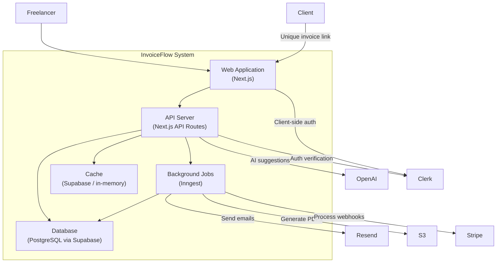

# Worked Example: Architecture Design — InvoiceFlow

## Scenario

InvoiceFlow is an AI-powered invoicing tool for freelance designers. It passed the Validation Pack with a GO recommendation. Key context from the pack:

- **Target user:** Freelance designers earning $50K-$150K/yr, managing 5-20 clients
- **Core features (Tier 1):** Invoice creation with AI-generated line items, recurring invoices, payment tracking, client portal, expense categorization
- **Revenue model:** Freemium (5 invoices/mo free) → $12/mo Pro → $29/mo Business
- **Data handled:** Client names, emails, billing addresses, invoice amounts, bank account info for payouts, payment history
- **Competitive positioning:** Simpler than FreshBooks, smarter than Wave, designed specifically for creative freelancers

---

## Section 1: Architectural Context

### 1a. Product Summary
- **Product name:** InvoiceFlow
- **One-line description:** AI-powered invoicing tool that helps freelance designers create, send, and track invoices with intelligent line-item suggestions.
- **Input source:** Validation Pack

### 1b. Architectural Drivers
- **Functional requirements:**
  1. Users create invoices with AI-assisted line item generation
  2. Invoices are sent via email with a client-facing payment portal
  3. Recurring invoices auto-generate on a schedule
  4. Payment status tracked (sent, viewed, paid, overdue)
  5. Expense categorization from bank/card transaction imports
  6. Dashboard showing revenue, outstanding invoices, overdue amounts
  7. PDF invoice generation with customizable templates
  8. Multi-currency support for international clients

- **Quality attributes:**
  - Availability: 99.9% uptime (invoices are time-sensitive for cash flow)
  - Performance: Invoice creation < 2s including AI line-item suggestions
  - Scalability: Support up to 10K users in year 1
  - Data integrity: Financial data must be consistent — no partial invoice states

- **Constraints:**
  - Solo technical founder, budget < $500/mo infrastructure
  - Must launch MVP in 8-12 weeks
  - No existing technology commitments
  - Payment processing must be PCI-DSS compliant (via Stripe — not handling card data directly)

- **Data sensitivity summary:**
  - PII: Client names, emails, addresses, phone numbers
  - Financial: Invoice amounts, payment history, bank account details for payouts, expense data
  - Restricted: Password hashes, OAuth tokens, Stripe customer IDs
  - Note: InvoiceFlow does NOT handle credit card numbers directly (Stripe does), but does handle bank account info for payouts

### 1c. Scale Parameters
| Parameter | Current Estimate | Confidence |
|-----------|-----------------|------------|
| Users at launch | 200-500 | M — based on waitlist projections from Validation Pack |
| Concurrent users | 20-50 | M — typical for freelancer SaaS (sporadic usage) |
| Transactions/day | 500-2,000 | M — invoice creates + payment events + dashboard loads |
| Data growth/month | ~500 MB | L — depends on PDF storage volume and expense import adoption |
| Geographic reach | US + EU | H — target market explicitly defined in personas |

---

## Section 2: System Context Diagram

### 2a. Diagram

```mermaid
graph TB
    Freelancer["Freelancer (Designer)"] -->|Creates invoices, views dashboard| InvoiceFlow["InvoiceFlow System"]
    Client["Client (Invoice Recipient)"] -->|Views invoice, makes payment| InvoiceFlow
    InvoiceFlow -->|Process payments| Stripe["Stripe"]
    InvoiceFlow -->|Send invoice emails, notifications| Resend["Resend (Email)"]
    InvoiceFlow -->|AI line-item suggestions| OpenAI["OpenAI API"]
    InvoiceFlow -->|Store files (PDFs, logos)| S3["AWS S3"]
    InvoiceFlow -->|User authentication| Clerk["Clerk (Auth)"]
    InvoiceFlow -->|Error tracking| Sentry["Sentry"]
    InvoiceFlow -->|Product analytics| PostHog["PostHog"]
```

### 2b. Actor Descriptions
| Actor | Type | Interaction | Data Exchanged |
|-------|------|------------|----------------|
| Freelancer | Human | Creates/manages invoices, views dashboard, manages settings | Invoice data, client info, financial summaries, account settings |
| Client | Human | Views invoice via unique link, makes payment | Invoice details (read-only), payment info (via Stripe checkout) |

### 2c. External Dependency Register
| Dependency | Purpose | Criticality | Fallback |
|------------|---------|-------------|----------|
| Stripe | Payment processing, subscription billing | Critical | No fallback — required for core functionality. Degrade gracefully: invoices still sendable, payment tracking paused |
| Clerk | User authentication and session management | Critical | No fallback at launch. Migration to Auth0 possible if needed (standard OIDC) |
| OpenAI API | AI line-item suggestions for invoices | Important | Graceful degradation: manual line-item entry. Feature disabled, not broken |
| Resend | Transactional email (invoice delivery, notifications) | Critical | Switch to SendGrid (pre-configure as backup). Queue emails if service is down |
| AWS S3 | PDF invoice storage, user logo uploads | Important | Serve cached versions. New PDFs generated on-demand from invoice data |
| Sentry | Error tracking and monitoring | Nice-to-have | Console logging. No user-facing impact |
| PostHog | Product analytics and feature flags | Nice-to-have | Disabled silently. No user-facing impact |

---

## Section 3: Container Architecture

### 3a. Container Diagram



### 3b. Container Specifications

| Field | Web Application |
|-------|----------------|
| **Name** | Web Application |
| **Responsibility** | Serve the freelancer dashboard and client invoice portal as a web UI |
| **Technology** | Next.js 14 (App Router) with React, TypeScript, Tailwind CSS |
| **Technology rationale** | Next.js combines SSR (for client invoice portal SEO/sharing) with SPA-like interactivity (for dashboard). App Router enables server components for faster initial loads. TypeScript for type safety across the stack. Solo founder = single framework for frontend + API reduces context switching |
| **Data owned** | None — stateless UI layer |
| **Interfaces exposed** | Browser-accessible pages: /dashboard, /invoices, /clients, /settings, /i/[invoiceId] (public client portal) |
| **Communication** | → API Server via Next.js API routes (co-located), → Clerk via client SDK (HTTPS) |

| Field | API Server |
|-------|-----------|
| **Name** | API Server |
| **Responsibility** | Handle business logic, data validation, orchestrate external service calls |
| **Technology** | Next.js API Routes (co-located with Web Application) |
| **Technology rationale** | Co-locating API with the web app eliminates a separate deployment for the API at this stage. Next.js API routes support edge functions and serverless deployment. When the API needs to separate (mobile app, third-party integrations), extract to standalone Express/Fastify service |
| **Data owned** | Business logic — reads/writes to Database, orchestrates Queue |
| **Interfaces exposed** | REST API: /api/invoices, /api/clients, /api/payments, /api/ai/suggest, /api/webhooks/stripe |
| **Communication** | → Database via Supabase client (HTTPS), → Queue via Inngest client (HTTPS), → External APIs (Stripe, OpenAI, Clerk) via HTTPS with API keys |

| Field | Database |
|-------|---------|
| **Name** | Database |
| **Responsibility** | Persist all application data: users, invoices, clients, payments, expenses |
| **Technology** | PostgreSQL via Supabase (managed) |
| **Technology rationale** | PostgreSQL for relational data integrity (financial data demands ACID). Supabase provides managed PostgreSQL with built-in row-level security, real-time subscriptions (for payment status updates), and auto-generated REST API as escape hatch. Free tier supports MVP scale |
| **Data owned** | All persistent application data (see Section 4c for data store details) |
| **Interfaces exposed** | Supabase client library (HTTPS with JWT auth), direct PostgreSQL connection for migrations |
| **Communication** | ← API Server via Supabase client, ← Queue via Supabase client |

| Field | Background Jobs |
|-------|----------------|
| **Name** | Background Jobs |
| **Responsibility** | Handle async work: send invoice emails, generate PDFs, process Stripe webhooks, trigger recurring invoices |
| **Technology** | Inngest (serverless event-driven functions) |
| **Technology rationale** | Inngest provides durable execution (retries, scheduling) without managing infrastructure. Cron support handles recurring invoices. Event-driven model fits payment webhook processing. Free tier covers MVP volume. Alternative: BullMQ + Redis, but requires self-managed infrastructure |
| **Data owned** | None — reads/writes via Database |
| **Interfaces exposed** | Event ingestion endpoint (receives events from API Server and Stripe webhooks) |
| **Communication** | ← API Server sends events, → Database for reads/writes, → Resend for emails, → S3 for PDF storage |

| Field | Cache |
|-------|------|
| **Name** | Cache |
| **Responsibility** | Cache dashboard aggregations and frequently-read data to reduce database load |
| **Technology** | In-memory caching (Next.js built-in) + Supabase edge caching |
| **Technology rationale** | At MVP scale (< 1K users), dedicated Redis is premature. Next.js ISR (Incremental Static Regeneration) handles dashboard caching. Supabase's built-in connection pooling handles query caching. Add Redis when cache invalidation becomes complex or user count exceeds 5K |
| **Data owned** | None — ephemeral copies of database data |
| **Interfaces exposed** | N/A — internal to API Server |
| **Communication** | ← API Server reads cached data |

### 3c. Architecture Pattern Decision
- **Pattern chosen:** Modular Monolith (Next.js full-stack application)
- **Rationale:** Solo founder, 8-12 week timeline, < 1K initial users. A single Next.js deployment handles web UI, API, and server-side rendering. Module boundaries defined by domain: invoicing, clients, payments, AI, auth. Separate deployment for background jobs (Inngest) because async processing has fundamentally different execution patterns (long-running, retryable).
- **Distribution triggers:**
  1. Mobile app launches → extract API to standalone service
  2. AI features become compute-heavy → extract AI service with GPU instances
  3. Team grows > 5 engineers → extract by domain boundary
  4. Invoice volume exceeds 100K/month → extract payment processing for independent scaling

---

## Section 4: Data Flow Diagrams

### 4a. User Journey Coverage
| # | Journey | Source |
|---|---------|--------|
| 1 | Create and send an invoice | Validation Pack Tier 1 — core feature |
| 2 | Client views and pays invoice | Validation Pack Tier 1 — payment tracking |
| 3 | Recurring invoice auto-generation | Validation Pack Tier 1 — recurring invoices |

### 4b. Data Flow per Journey

**Journey 1: Create and Send an Invoice**
```
Step 1: Freelancer → Web App | Data: line items, client selection, amounts, due date | Sensitivity: Confidential
---[TRUST BOUNDARY: Browser → Server]---
Step 2: Web App → API Server | Data: invoice creation request (validated) | Sensitivity: Confidential
Step 3: API Server → OpenAI API | Data: invoice context (anonymized — no client PII) | Sensitivity: Internal
---[TRUST BOUNDARY: Server → External API]---
Step 4: OpenAI API → API Server | Data: suggested line items | Sensitivity: Internal
Step 5: API Server → Database | Data: invoice record (client_id, items, amounts, status=draft) | Sensitivity: Confidential
Step 6: Freelancer confirms send → API Server | Data: send command | Sensitivity: Internal
Step 7: API Server → Queue | Data: invoice_id, recipient_email event | Sensitivity: Confidential
Step 8: Queue → PDF Generator → S3 | Data: rendered PDF invoice | Sensitivity: Confidential
---[TRUST BOUNDARY: Server → File Storage]---
Step 9: Queue → Resend | Data: recipient email, invoice link, PDF attachment | Sensitivity: Confidential
---[TRUST BOUNDARY: Server → External Email Service]---
Step 10: API Server → Database | Data: status update (status=sent, sent_at) | Sensitivity: Internal
```

**Journey 2: Client Views and Pays Invoice**
```
Step 1: Client clicks email link → Web App | Data: invoice token (unique, non-guessable) | Sensitivity: Internal
---[TRUST BOUNDARY: Browser → Server (unauthenticated)]---
Step 2: Web App → API Server | Data: invoice lookup by token | Sensitivity: Internal
Step 3: API Server → Database | Data: invoice details, line items, amounts | Sensitivity: Confidential
Step 4: API Server → Web App → Client | Data: rendered invoice (read-only) | Sensitivity: Confidential
Step 5: Client clicks "Pay" → Stripe Checkout | Data: amount, currency, Stripe invoice metadata | Sensitivity: Restricted
---[TRUST BOUNDARY: Browser → Payment Processor (Stripe hosted)]---
Step 6: Stripe → Queue (webhook) | Data: payment_intent.succeeded event, amount, invoice_id | Sensitivity: Restricted
---[TRUST BOUNDARY: External Payment Processor → Server]---
Step 7: Queue → Database | Data: payment record, invoice status=paid, paid_at | Sensitivity: Confidential
Step 8: Queue → Resend | Data: payment confirmation email to freelancer | Sensitivity: Internal
```

**Journey 3: Recurring Invoice Auto-Generation**
```
Step 1: Inngest cron trigger (daily at 6am UTC) → Queue | Data: scheduled event | Sensitivity: Internal
Step 2: Queue → Database | Data: query recurring invoices due today | Sensitivity: Confidential
Step 3: Database → Queue | Data: recurring invoice templates with client details | Sensitivity: Confidential
Step 4: Queue → Database | Data: new invoice records (cloned from template, new dates/amounts) | Sensitivity: Confidential
Step 5: Queue → PDF Generator → S3 | Data: rendered PDF invoices | Sensitivity: Confidential
Step 6: Queue → Resend | Data: invoice emails to clients | Sensitivity: Confidential
Step 7: Queue → Database | Data: status updates, next_recurrence_date | Sensitivity: Internal
```

### 4c. Data Store Summary
| Data Store | Technology | Data Types | Sensitivity | Access Pattern | Retention |
|-----------|-----------|-----------|-------------|---------------|-----------|
| Primary DB | PostgreSQL (Supabase) | Users, invoices, clients, payments, expenses, recurring templates | Confidential (PII + financial) | Write-heavy during invoice creation, read-heavy for dashboard | Indefinite (financial records — 7yr minimum for tax) |
| File Storage | AWS S3 | Generated PDF invoices, user logo uploads, expense receipt images | Confidential | Write-once on generation, read on client view/download | Same as invoice retention (7yr) |
| Session Store | Clerk (external) | Session tokens, auth state | Restricted | Read-heavy (every authenticated request) | Clerk-managed (configurable TTL) |
| Stripe Data | Stripe (external) | Payment intents, customer IDs, subscription state | Restricted | Event-driven (webhooks) | Stripe-managed |

---

## Section 5: Authentication & Authorization Design

### 5a. Authentication
- **Approach:** Third-party auth provider (Clerk) with OAuth 2.0
- **Provider:** Clerk — provides pre-built React components, handles email/password + Google OAuth, manages sessions, supports organization model for future team features. Chosen over Auth0 (simpler DX, better React integration, generous free tier) and Firebase Auth (better UI components, organization model)
- **User types:**
  - Freelancer (authenticated, full access to their data)
  - Client (unauthenticated, token-based access to specific invoices only)
- **Login methods:** Email/password, Google OAuth (covers 90%+ of freelancer designers per persona research)
- **Token/session management:** Clerk manages JWT sessions. Short-lived access tokens (5 min) with automatic refresh. Session stored in httpOnly cookie. Clerk's middleware validates on every API route

### 5b. Authorization
- **Model:** Simple role check (2 roles at MVP)
- **Roles defined:**
  - **Owner:** Full access to their own invoices, clients, payments, settings. Cannot access other users' data
  - **Client (implicit):** Read-only access to invoices shared with them via unique token. No account required
- **Resource-level permissions:** Row-level security in Supabase enforces user_id = authenticated user on all queries. Client invoice access uses unique non-guessable token (UUID v4), not authentication

### 5c. API Security
- **Authentication method:** Bearer token (Clerk JWT) for authenticated endpoints. Unique invoice token (URL parameter) for client portal
- **Rate limiting:** 100 requests/minute per user for API endpoints. 10 requests/minute for unauthenticated invoice viewing. Implemented via Vercel/hosting-level rate limiting at MVP; middleware rate limiting if self-hosted
- **Sensitive operations:**
  - Bank account connection → re-authentication required (Clerk step-up auth)
  - Account deletion → email confirmation + 7-day grace period
  - Bulk invoice operations (> 10) → confirmation prompt (prevent accidental mass-send)

---

## Section 6: Storage Architecture

### 6a. Primary Database
- **Technology:** PostgreSQL 15 via Supabase
- **Rationale:** ACID compliance essential for financial data (no partial invoice states). Supabase provides managed PostgreSQL with row-level security (critical for multi-tenant data isolation), real-time subscriptions (payment status updates), built-in auth integration, and generous free tier (500MB, 50K monthly active users)
- **Hosting:** Supabase managed (AWS us-east-1 for US users, can add EU region later)
- **Key entities:**
  - User → has many Clients, Invoices, Expenses
  - Client → belongs to User, has many Invoices
  - Invoice → belongs to User + Client, has many LineItems, has one Payment
  - LineItem → belongs to Invoice
  - Payment → belongs to Invoice (tracked via Stripe webhook)
  - RecurringTemplate → belongs to User + Client, generates Invoices
  - Expense → belongs to User, optional category

### 6b. File/Blob Storage
- **Technology:** AWS S3 (us-east-1)
- **Access pattern:** Presigned URLs for upload (user logos) and download (PDF invoices). PDFs generated server-side, uploaded to S3, URL stored in invoice record
- **Security:** Private bucket, presigned URLs with 1-hour expiry for downloads. Server-side encryption (AES-256). Bucket policy restricts access to application IAM role only

### 6c. Caching
- **Technology:** Next.js ISR (Incremental Static Regeneration) + Supabase connection pooling
- **What's cached:** Dashboard aggregation queries (total revenue, outstanding amounts), invoice list views. NOT cached: individual invoice details (must be real-time for payment status)
- **Invalidation strategy:** Time-based (ISR revalidates every 60 seconds for dashboard), event-based (Stripe webhook triggers cache invalidation for payment-related queries)

### 6d. Backup & Recovery
- **Approach:** Supabase automated daily backups (included in Pro plan) + point-in-time recovery (PITR). On free plan: daily backups with 7-day retention
- **RPO/RTO targets:** RPO: 24 hours (daily backup) → upgrade to PITR (seconds) at Pro tier. RTO: < 1 hour (Supabase managed restore). Financial data is critical — upgrade to Pro plan ($25/mo) before paying users onboard

---

## Section 7: Tech Stack Recommendation

### 7a. Stack Summary Table
| Layer | Technology | Score | Rationale | Trade-offs |
|-------|-----------|-------|-----------|------------|
| Frontend | Next.js 14 + React + TypeScript + Tailwind | 4.5 | SSR for invoice portal, SPA for dashboard, single framework for full stack, massive ecosystem, TypeScript shared with API | Heavier than Astro/Svelte for simple pages; offset by dashboard interactivity needs |
| Backend | Next.js API Routes (serverless) | 4.0 | Co-located with frontend (one deployment), serverless = no server management, Vercel deployment | Cold starts on infrequent routes; limited for CPU-heavy work (extract AI later) |
| Database | PostgreSQL via Supabase | 4.5 | ACID for financial data, RLS for multi-tenancy, real-time subscriptions, generous free tier, migration path to raw Postgres | Vendor coupling to Supabase SDK; mitigated by standard PostgreSQL underneath |
| Auth | Clerk | 4.0 | Best React integration, pre-built components, organization model for future, generous free tier | Vendor lock-in (mitigated by standard OIDC export); cost scales with MAU |
| Payments | Stripe | 5.0 | Industry standard, Stripe Invoicing could overlap but InvoiceFlow adds AI/design focus. No realistic alternative for payment processing at this stage | Revenue share (2.9% + $0.30/txn); accepted cost of not handling PCI compliance |
| Background Jobs | Inngest | 4.0 | Durable execution, cron scheduling, event-driven, serverless, free tier covers MVP | Newer platform (est. 2022), smaller community; fallback to BullMQ + Redis if needed |
| Hosting | Vercel | 4.0 | Native Next.js hosting, global CDN, serverless functions, preview deployments, free tier | Costs scale with function invocations; monitor spend monthly; migrate to Railway/Fly.io if costs exceed $50/mo |
| Email | Resend | 4.0 | Clean API, React email templates, deliverability focus, reasonable pricing | Newer service; pre-configure SendGrid as backup |
| Monitoring | Sentry + PostHog | 3.5 | Sentry for errors (essential), PostHog for analytics + feature flags (two-for-one) | PostHog self-host option available if data residency becomes a concern |

### 7b. Build vs. Buy Decisions
| Capability | Decision | Option Chosen | Rationale |
|-----------|----------|--------------|-----------|
| Authentication | Buy | Clerk | Auth is undifferentiated; Clerk reduces 2-3 weeks of auth implementation to 2 hours |
| Payment processing | Buy | Stripe | Regulatory requirement; never build payment processing |
| AI line-item suggestions | Build | OpenAI API + custom prompt engineering | Core differentiator; prompt design is the product's IP |
| PDF generation | Build | React-PDF or Puppeteer | Invoice template design is a differentiator for creative freelancers; existing generators are too generic |
| Email delivery | Buy | Resend | Deliverability is specialized; focus on invoice content, not SMTP infrastructure |
| File storage | Buy | AWS S3 | Commodity infrastructure; no reason to build |
| Database hosting | Buy | Supabase | Managed PostgreSQL with extras; no reason to manage own database |
| Dashboard analytics | Build | Custom queries + charting library | Revenue dashboards are product-specific; generic analytics tools can't model invoice/payment data correctly |

---

## Section 8: Architecture Decision Record

### 8a. Key Decisions
| # | Decision | Rationale | Alternatives Considered | Trade-offs Accepted |
|---|----------|-----------|------------------------|-------------------|
| 1 | Modular monolith (Next.js full-stack) | Solo founder, 8-12 week timeline, single deployment simplicity | Separate React SPA + Express API; would require 2 deployments, CORS config, separate hosting | Coupled frontend/backend deployment; accepted because benefits (speed, simplicity) outweigh costs at this scale |
| 2 | PostgreSQL via Supabase (not MongoDB or PlanetScale) | Financial data requires ACID transactions; Supabase adds RLS + real-time for free; standard SQL for team scaling | MongoDB (flexible schema, but no transactions for multi-table invoice operations), PlanetScale (MySQL, good but PostgreSQL ecosystem is richer) | Supabase SDK coupling; mitigated by using standard PostgreSQL queries where possible |
| 3 | Clerk for auth (not Auth0 or build custom) | Best React DX, pre-built components save 2-3 weeks, organization model ready for team features | Auth0 (more enterprise features but worse DX), Firebase Auth (good but no org model), Custom (2-3 weeks to build, ongoing maintenance) | Vendor lock-in; mitigated by standard OIDC, exportable user data |
| 4 | Unauthenticated client portal with unique tokens | Clients should pay invoices without creating accounts (reduces friction, matches Wave/FreshBooks pattern) | Require client accounts (adds friction, kills conversion), Email-based OTP (adds complexity) | Less secure than authenticated access; mitigated by non-guessable UUIDs, rate limiting, no sensitive actions available |
| 5 | Inngest for background jobs (not BullMQ or cron) | Serverless execution matches Vercel hosting, durable execution handles payment webhook reliability, cron for recurring invoices | BullMQ + Redis (proven but requires managed Redis infrastructure), Native Vercel cron (limited to HTTP triggers, no retry logic) | Newer platform dependency; mitigated by simple event interface that could migrate to BullMQ |
| 6 | AI features call OpenAI directly (not abstracted) | MVP speed; prompt engineering is the IP, not the LLM provider abstraction | LangChain/LiteLLM abstraction (adds dependency for single-provider use), Fine-tuned model (premature, need usage data first) | OpenAI vendor lock-in for AI features; mitigated by isolating AI calls to single module, swap provider by changing one file |
| 7 | S3 for file storage (not Supabase Storage) | S3 is industry standard, better CDN integration, IAM-based security, won't be affected if Supabase is swapped | Supabase Storage (simpler but couples another service to Supabase), Cloudflare R2 (cheaper egress but less ecosystem) | Additional AWS dependency; accepted for reliability and flexibility |

### 8b. Deferred Decisions
| Decision | Why Deferred | When to Revisit |
|----------|-------------|----------------|
| Detailed API endpoint specifications | API routes will emerge from feature implementation; specifying now would be speculative | During Sprint 1 implementation (Batch 6: API Design skill) |
| Database schema (column-level) | Entity relationships defined, but exact columns depend on feature details during build | During Sprint 1 implementation (Batch 6: Database Expert skill) |
| Infrastructure sizing and autoscaling | No load data exists; Vercel serverless auto-scales by default | When monthly costs exceed $100 or response times degrade |
| Multi-region deployment | US-first launch; EU region added when EU user base justifies latency improvement | When EU users exceed 20% of base or GDPR data residency is required |
| Mobile app architecture | Web-first; mobile may require React Native or native apps | When mobile usage signals emerge from analytics (6-12 months post-launch) |

### 8c. Risk Flags
| Risk | Severity | Mitigation | Related Decision |
|------|----------|-----------|-----------------|
| Supabase outage takes down database + auth could cascade | High | Clerk handles auth independently. Database backups enable migration to raw PostgreSQL within hours. Monitor Supabase status page | ADR #2 |
| Vercel serverless cold starts affect invoice creation UX | Medium | Pre-warm critical routes. Move AI suggestion to streaming response (partial results while loading). Monitor P95 latency | ADR #1 |
| Stripe webhook delivery failures cause missed payment updates | High | Inngest provides durable execution with automatic retries. Implement daily reconciliation job that syncs Stripe payment status | ADR #5 |
| OpenAI API latency or outage blocks invoice creation | Medium | AI suggestions are non-blocking (show after initial invoice form loads). Graceful degradation to manual entry if API fails | ADR #6 |
| Financial data in Supabase free tier (shared infrastructure) | Medium | Upgrade to Supabase Pro ($25/mo) before accepting paying users. Enables PITR, dedicated resources, and SOC 2 compliance | ADR #2 |

### 8d. Security Review Readiness
- **Components named and bounded:** Yes — 5 containers with defined responsibilities and interfaces
- **Data flows mapped with sensitivity:** Yes — 3 journeys mapped with sensitivity levels at each hop
- **Auth approach specified:** Yes — Clerk for freelancers, token-based for clients, with API security details
- **Trust boundaries identified:** Yes — browser→server, server→external API, server→payment processor, server→file storage
- **Gaps for security team:**
  - Client portal token security: Are UUID v4 tokens sufficient, or should time-limited signed URLs be used?
  - AI prompt injection: Can malicious invoice descriptions manipulate AI line-item suggestions?
  - Expense import: If bank/card transaction import is added, what's the auth flow for financial data providers (Plaid)?
  - Rate limiting specifics: Exact thresholds need tuning based on expected usage patterns
